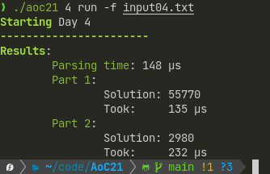
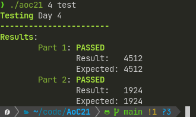

# Advent of Code 2022

)

The second year in a row that I use Rust. I truly fell in love with rust, however, I haven't been coding too much lately, so might be a bit rusty.  
Anyhow, this repository contains my solutions for [Advent of Code 2022](https://adventofcode.com/2022/) written in Rust.

I am lazy and currently setting up this project in a hurry just so I have the basic framework tomorrow (2022/12/01), so this project is literally a cleaned-up copy of my [solutions for last year](https://github.com/LeMoonStar/AoC21).  
**The Following therefore still contains screenshots of the previous years binary. The usage is the same, but the name is `aoc22` instead of `aoc21`**

## Usage

There are multiple ways to run my solutions, the easiest and most comfortable one is the `auto` command:  
It automatically downloads your input. For this it requires you to provide your Advent of Code session id, which you can find in the websites cookies after logging in.  
Simply provide it by setting the `AOC_SESSION` environment variable or using the -s argument:  
`AOC_SESSION=XXXMYSESSION ./aoc22 [DAY] auto` or `./aoc22 [DAY] auto -s XXXMYSESSION`.  
In this example, I set the environment variable for the terminal session using `export AOC_SESSION=XXXMYSESSION`, so I can run it without specifying the session id again:  
  

If you don't want to automatically download the input, you can also use the `run` command, which uses a locally stored file or the stdin input:  
`./aoc22 [DAY] run -f my_input.txt`:  
  

If you just want to run the day's example, simply use the `test` command, as this project already includes the examples:
`./aoc22 [DAY] test`:  
  

## Compiling

This project uses `Cargo`, so compiling is pretty easy:  
`cargo build --release`  
The resulting binary can be found at `./targets/release/aoc22`. You can also directly run the project using `cargo run --release [arguments for aoc21]`  
the `--release` option is not required, but it results in better performance.

## Check out other solutions to AoC21

| Repository                                                                                           | Language                                |
|------------------------------------------------------------------------------------------------------|-----------------------------------------|
| [TrojanerHD's AdventOfCode2022](https://github.com/TrojanerHD/AdventofCode2022)                      | TypeScript                              |
| [NetworkException's AdventOfCode (2022)](https://github.com/networkException/AdventOfCode/tree/2022) | Kotlin                                  |
| [derNiklaas' Advent-of-Code-2022](https://github.com/derNiklaas/Advent-of-Code-2022)                 | Kotlin                                  |
| [andi's aoc2022](https://git.schmarrn.dev/andi/aoc2022/) [External Site!]                            | Rust                                    |
| [noeppi_noeppi's aoc (2022)](https://github.com/noeppi-noeppi/aoc/tree/master/2022)                  | Multiple Languages                      |
| [Sammy's AdventOfCOde](https://github.com/1Turtle/AdventOfCode)                                      | Lua                                     |
